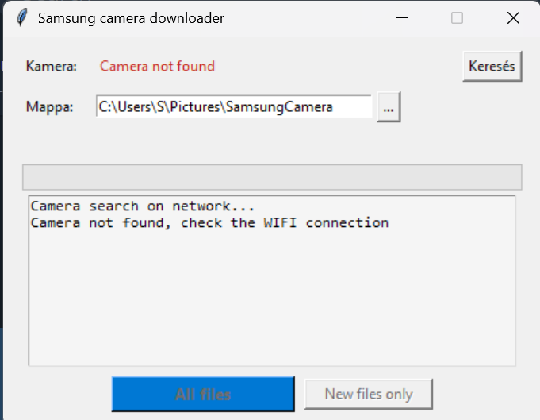

# Samsung Camera Downloader

A Windows tool for downloading photos and videos from **Samsung WiFi cameras** (WB, NX, ST, EX series, ~2012–2015) over your local network.

Works as both a **GUI app** (double-click `.exe`) and a **command-line tool**.

  



---

## Background

Samsung's original **MobileLink** Android app (last version: 1.7.13, ~2014) no longer works on modern Android. These cameras use standard **UPnP/DLNA** over WiFi, so a replacement client can be written from scratch.

This tool was reverse-engineered from the original APK (`com.samsungimaging.filesharing`) and tested on a **WB350F**.

Supported camera families (confirmed by APK): NX1000, NX20, NX210, QF30, WB150, WB300, WB350F, WB850, ST200, EX2 — and likely any Samsung WiFi camera that exposes a DLNA ContentDirectory service.

> **Note:** Windows Explorer also works natively (`Network → [Camera]WB350F`), but this tool is more convenient for bulk downloads and automation.

---

## Requirements

- Windows 10 or 11
- Camera connected to the **same WiFi network** as your PC
  - Enable **AutoShare** or **MobileLink** mode on the camera so it joins your network
- Python 3.8+ (only needed if running from source)

---

## Usage

### Option A — Pre-built `.exe` (no Python needed)

Download `SamsungCameraDownloader.exe` from the [Releases](../../releases) page.

1. Turn on your Samsung camera and enable WiFi (AutoShare / MobileLink mode)
2. Make sure your PC is on the **same WiFi network**
3. Double-click `SamsungCameraDownloader.exe`
4. The app finds the camera automatically and shows how many files are on it
5. Choose a destination folder and click **Download All** or **New Only**

### Option B — Command line (`samsung_link.py`)

```bash
# Discover cameras on the network
py samsung_link.py discover

# Browse files without downloading
py samsung_link.py browse

# Download everything
py samsung_link.py download --dest C:\Photos\Camera

# Connect manually by IP (if auto-discovery fails)
py samsung_link.py manual 192.168.0.225 --dest C:\Photos\Camera
```

---

## Building from Source

### 1. Clone the repo

```bash
git clone https://github.com/yourusername/samsung-camera-downloader.git
cd samsung-camera-downloader
```

### 2. Install dependencies

```bash
py -m pip install pyinstaller
```

No other dependencies — the tool uses only Python standard library (`socket`, `urllib`, `xml`, `tkinter`).

### 3. Run without building

```bash
# GUI
py samsung_downloader.py

# CLI
py samsung_link.py discover
```

### 4. Build the `.exe`

```bash
py -m PyInstaller --onefile --windowed --name "SamsungCameraDownloader" samsung_downloader.py
```

The output will be at `dist\SamsungCameraDownloader.exe` (~12 MB, no installer needed).

---

## How It Works

1. **Discovery** — Sends an SSDP M-SEARCH multicast (`239.255.255.250:1900`) on all local network interfaces to find UPnP root devices
2. **Identification** — Fetches the UPnP device description XML and looks for a Samsung device with a `ContentDirectory` service
3. **Browsing** — Calls the UPnP `Browse` (SOAP) action recursively to list all photos and videos
4. **Download** — Downloads each file via plain HTTP from the URLs in the DIDL-Lite response

The camera acts as a standard **DLNA Digital Media Server (DMS-1.50)**, so the protocol is fully open and documented.

### Why auto-discovery sometimes fails

Windows has multiple network adapters (Hyper-V, WSL, VPN, etc.) and the SSDP multicast may go out on the wrong interface. This tool explicitly binds to non-`172.x` interfaces to avoid this. If discovery still fails, use the `manual` command with the camera's IP address (visible in the camera's WiFi status menu or your router's device list).

---

## Limitations

- **No remote delete** — The WB350F (and likely other models) mark their content containers as `restricted="1"`, which blocks `DestroyObject` via UPnP. HTTP DELETE is also rejected. Delete files on the camera itself.
- **Windows only** — Due to `tkinter` GUI and Windows-specific network adapter filtering. The CLI (`samsung_link.py`) should work on Linux/macOS with minor adjustments.
- **Same network required** — The camera must be on the same subnet as your PC. Direct hotspot mode (camera creates its own AP) also works if you connect your PC to it.

---

## Project Structure

```
samsung_downloader.py   — GUI app (tkinter)
samsung_link.py         — CLI tool
```

---

## License

MIT
